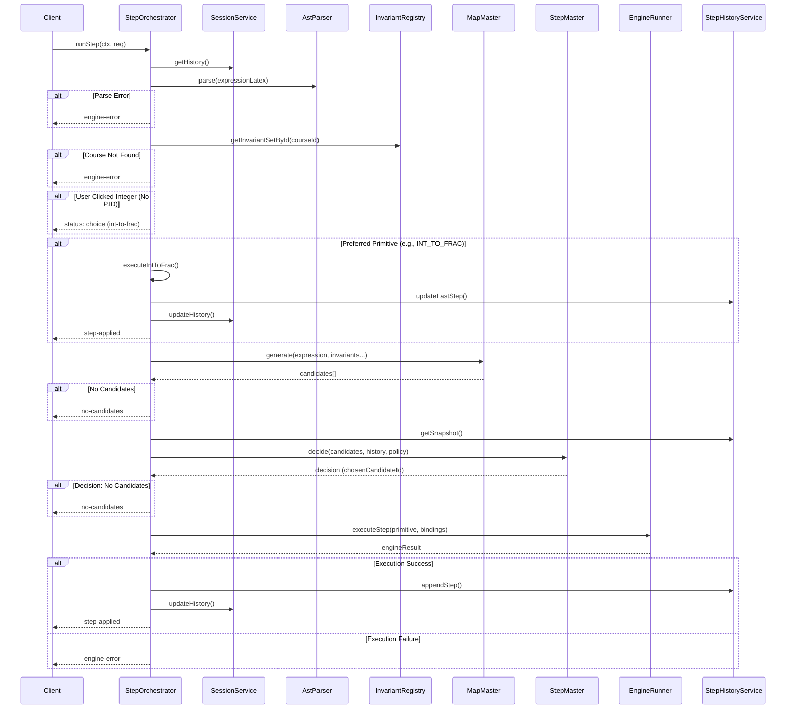

# StepOrchestrator.runStep Method Explanation

The `runStep` method is the central coordinator for executing a single mathematical transformation step within the `StepOrchestrator` class. It manages the flow from receiving a user request to applying a transformation and updating the history.

## Workflow Overview

1.  **Context Preparation**: Logs the step and loads the session history from the `SessionService`.
2.  **Input Parsing**: Parses the input LaTeX expression into an Abstract Syntax Tree (AST) using `AstParser`.
3.  **Invariant Check**: Retrieves the valid rules (invariants) for the current course context from the `InvariantRegistry`.
4.  **Interaction Handling**:
    - **Integer Click**: If the user clicked an integer, it immediately returns a "choice" status to offer a conversion to a fraction, bypassing the engine search.
    - **Direct Execution**: If a `preferredPrimitiveId` is provided (e.g., resulting from a previous choice), it executes that specific primitive directly (e.g., `executeIntToFrac`).
5.  **Candidate Generation**: Calls `MapMaster.generate()` to explore all possible valid mathematical transformations (candidates) for the current expression based on the active invariants.
6.  **Decision Making**: Delegates to `StepMaster.decide()` to select the best candidate from the list based on the current policy and execution history.
7.  **Execution**: Applies the selected transformation using `EngineRunner.executeStep()`.
8.  **Finalization**: If successful, updates the step history with the result using `StepHistoryService` and persists it to the session.

## Sequence Diagram

## Return Values

The method returns a `Promise<OrchestratorStepResult>` which can have the following statuses:

- `step-applied`: The transformation was successfully applied. The result contains the new LaTeX expression.
- `choice`: The system requires user input (e.g., clarifying an ambiguous click like an integer). Returns a list of available choices.
- `no-candidates`: No valid mathematical moves were found for the current state.
- `engine-error`: An error occurred during parsing, validation, or execution. Contains an error code.
