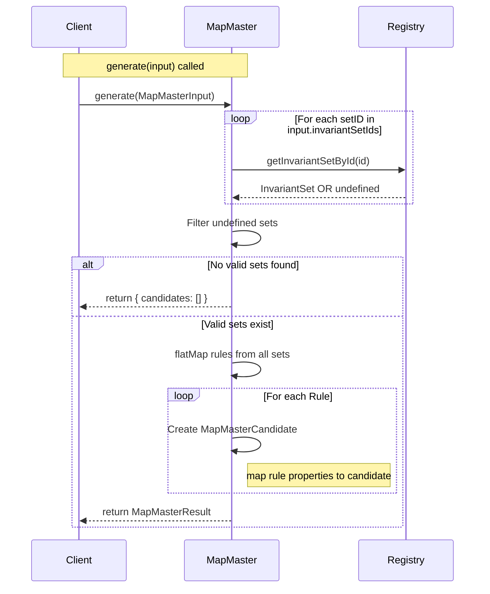

# MapMaster Data Processing Flow

This document details how the `MapMaster` class processes input data to generate step candidates for mathematical expressions.

## 1. Input Structure (`MapMasterInput`)

The process begins when the `generate()` method is called with a `MapMasterInput` object containing:

- **`expressionLatex`**: The raw LaTeX string of the mathematical expression (e.g., `"x + x"`).
- **`registry`**: A reference to the Invariant Registry containing all available math rules.
- **`invariantSetIds`**: A list of IDs representing groups of rules to check (e.g., `["algebra-basic", "arithmetic"]`).
- **`selectionPath`**: (Optional) A specific part of the expression tree selected by the user.

## 2. Processing Pipeline

The data flows through the following stages:

### Stage 1: Context & Logging

The system logs the start of generation for the specific LaTeX expression to aid in debugging.

### Stage 2: Invariant Set Retrieval

- **Input**: `invariantSetIds` (Array of Strings)
- **Action**: The system iterates through the provided IDs and queries the `registry` for the corresponding `InvariantSet` objects.
- **Filtering**: Invalid IDs or sets that return `undefined` are filtered out.
- **Early Exit**: If no valid sets are found, the process terminates early with a warning and returns an empty candidate list.

### Stage 3: Rule Aggregation

- **Action**: The system flattens the list of valid `InvariantSet` objects.
- **Result**: A single, flat array containing every individual `InvariantRule` from all requested sets (`allRules`).

### Stage 4: Candidate Generation (Current Implementation)

- **Action**: The system iterates over `allRules`.
- **Transformation**: Each rule is directly mapped to a `MapMasterCandidate` object.
  - **Id**: Generated as a unique string combination (e.g., `candidate-{ruleId}-{index}`).
  - **InvariantRuleId**: Links back to the rule that generated this candidate.
  - **PrimitiveIds**: The low-level operations associated with the rule.
  - **TargetPath**: Defaults to `"root"` if no selection was provided.
  - **Description**: The user-friendly label from the rule (e.g., "Combine into 2x").
  - **Category**: set to `"direct"`.

_> **Note**: in this version of the implementation, MapMaster does not perform deep pattern matching to verify if the rule strictly applies to the AST. It currently treats all rules in the requested sets as valid candidates._

## 3. Output (`MapMasterResult`)

The process returns a `MapMasterResult` object containing:

- **`candidates`**: The array of generated suggestion objects ready for the UI or Orchestrator.
- **`resolvedSelectionPath`**: The selection path used during generation.

## 4. Visual Sequence

