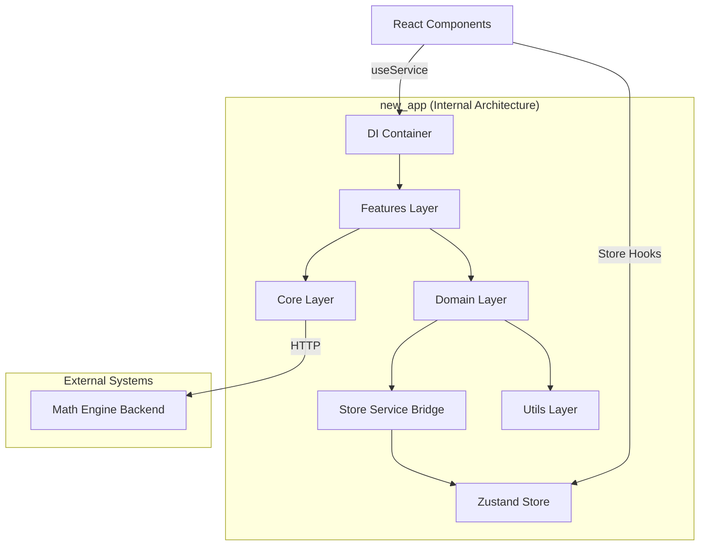
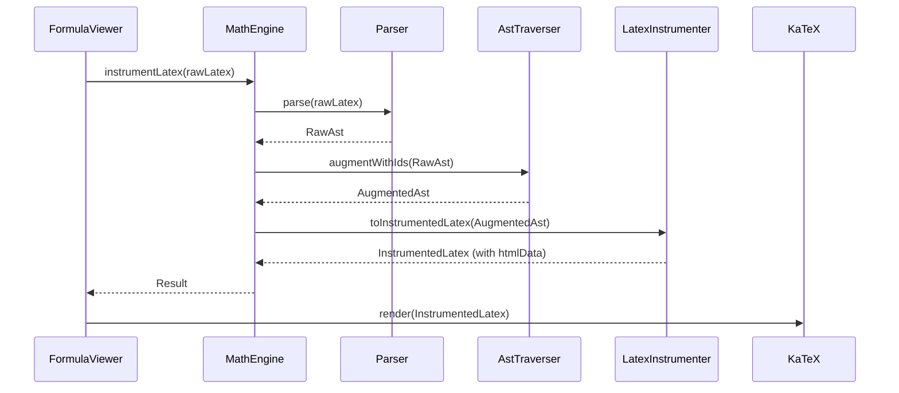
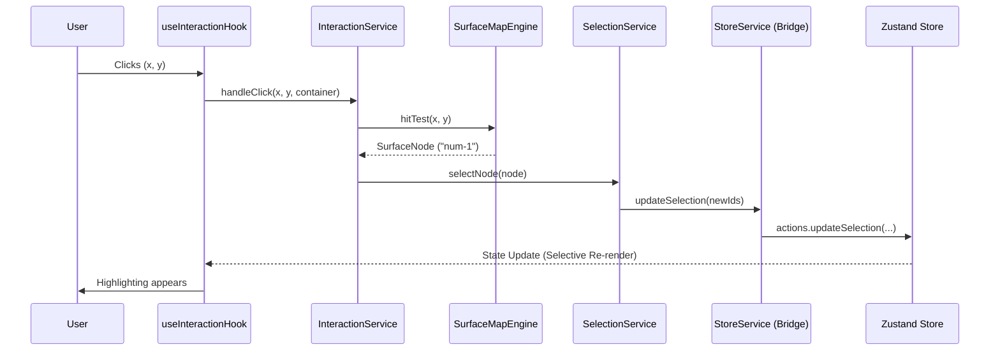

# New Architecture Documentation (`src/new_app`)

This document outlines the refined, SOLID-compliant architecture implemented in the `src/new_app` directory. This refactor migrates the project from a legacy procedural structure to a modern, class-based, and Dependency-Injection (DI) driven architecture.

---

## 1. Architectural Overview

The application follows a **Clean Architecture** pattern, organized into distinct layers to ensure separation of concerns and testability.

### 1.1 The Dependency Rule

Dependencies only point inwards. The **Domain** layer (Business Logic) knows nothing about the **UI** or **Infrastructure**. It defines interfaces that the outer layers implement.

### 1.2 Tech Stack

- **Dependency Injection**: [tsyringe](https://github.com/microsoft/tsyringe)
- **State Management**: [Zustand](https://github.com/pmndrs/zustand) (bridged via `StoreService`)
- **Typescript**: Strict mode with `verbatimModuleSyntax` and `erasableSyntaxOnly` compliance.

---

## 2. Layer Responsibilities

### 2.1 Core Layer (`src/new_app/core`)

**Responsibility**: Low-level infrastructure and external communication.

- **`FileBus`**: A message-oriented middleware for event-driven communication between decoupled components.
- **`OrchestratorClient`**: Specialized handler for the Math Engine backend.
- **`IntrospectClient`**: Service for fetching formula metadata and scenarios.
- **`Logger`**: Unified logging interface with support for different log levels.

### 2.2 Store Layer (`src/new_app/store`)

**Responsibility**: The bridge between the Domain logic and the Reactive UI state.

- **`StoreService`**: Implements `IStoreService`. It isolates the business logic from the React/Zustand implementation details. It provides methods for:
  - Formula management (Latex, rendering status).
  - Interaction state (Selection sets, hover targets).
  - System logging.

### 2.3 Domain Layer (`src/new_app/domain`)

**Responsibility**: The "Brain" of the application. Contains math logic and interaction rules.

#### Math Sub-domain

- **`MathEngine`**: Orchestrates parsing and instrumentation.
- **`Parser`**: Recursive descent parser for LaTeX arithmetic.
- **`LatexInstrumenter`**: Injects `\htmlData` tags for DOM-Node correlation.
- **`AstTraverser`**: Tree-walking logic for ID augmentation and node enumeration.

#### Surface Map Sub-domain

- **`SurfaceMapEngine`**: Entry point for spatial queries and map lifecycle.
- **`KaTeXMapBuilder`**: Strategy for scanning KaTeX DOM and building the semantic symbol tree.
- **`NodeClassifier`**: Heuristics for identifying KaTeX symbols.
- **`GeometryProvider`**: Logic for coordinate mapping and bounding box interpolation.

#### Selection & Interaction

- **`SelectionService`**: Central authority for selection state (multi-select, primary selection logic).
- **`InteractionService`**: Orchestrates high-level gestures into domain actions (e.g., "Hover at X,Y" -> "Update Hover Target Information").

### 2.4 Features Layer (`src/new_app/features`)

**Responsibility**: Application-specific use cases and service orchestration.

- **`EngineBridge`**: Connects the UI events (via FileBus) to the Backend Math Orchestrator.
- **`TraceRecorder`**: Manages diagnostic tracing and event history for debugging.
- **`Introspection`**: Orchestrates formula metadata visualization.

---

## 3. Architecture Diagram



---

## 4. Sequence Diagrams

### 4.1 Formula Rendering Flow

This diagram shows how LaTeX input is transformed into instrumented code and rendered.



### 4.2 Interaction Flow (Node Selection)

This diagram illustrates how a user click on a math symbol is processed.



---

## 5. Dependency Injection (DI) System

The project uses constructor injection. Services declare their dependencies via constructor parameters, which are fulfilled by the `tsyringe` container.

### Registration Strategy

All services are registered as **Singletons** in `di/container.ts`:

```typescript
container.register(
  Tokens.IMathEngine,
  { useClass: MathEngine },
  { lifecycle: Lifecycle.Singleton },
);
```

### Resolution in React

Components use the custom `useService` hook to access domain logic:

```typescript
const mathEngine = useService(Tokens.IMathEngine);
```
