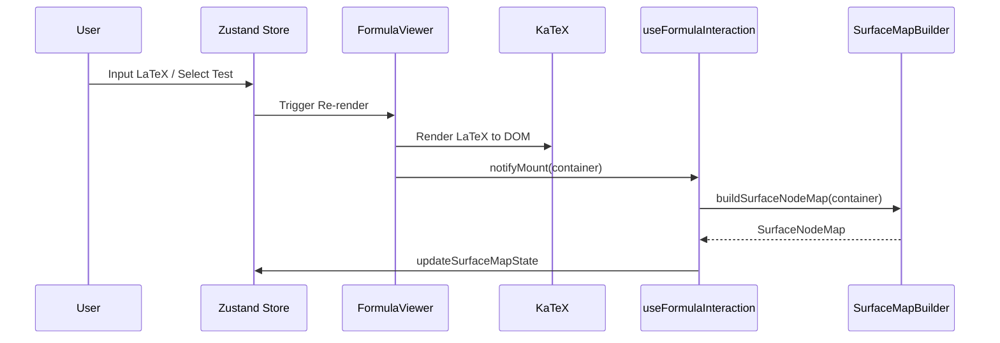
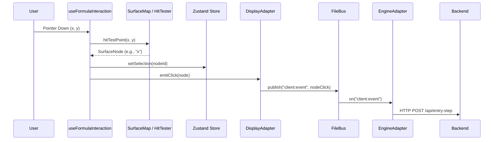

# Project Architecture Analysis: `react-viewer`

## 1. Executive Summary

The `react-viewer` project is a sophisticated React-based application designed for viewing and interacting with mathematical formulas. It leverages **KaTeX** for high-quality math typesetting and implements a custom **Surface Mapping** layer to enable semantic interaction with individual components of a formula (e.g., clicking on a variable, selecting an operator and its operands).

The project follows a **Decoupled Layered Architecture** (Ports and Adapters), allowing the UI to remain independent of the backend engine logic.

---

## 2. Module Identification

### 2.1 UI Layer (`src/components` & `src/hooks`)

- **FormulaViewer**: The primary display component. It wraps KaTeX and manages the DOM container where the formula is rendered.
- **Zustand Store (`useViewerStore`)**: Centralized state management for the UI, including LaTeX content, hover states, and application settings.
- **Interaction Hooks**:
  - `useFormulaInteraction`: Orchestrates pointer events (click, drag, rect-selection) and translates them into semantic actions.
  - `useEngine`: Connects the UI to the backend engine lifecycle.
  - `useAppEvents`: Manages global shortcuts and shared event handlers.

### 2.2 Core Logic Layer (`src/app/core`)

- **FileBus**: A message-oriented middleware used for cross-module communication without direct dependencies.
- **Debugger**: A diagnostic utility for tracking internal state and performance.
- **ApiClient**: Standardized gateway for communicating with external APIs.
- **State**: Legacy shared state objects (to be fully migrated to Zustand).

### 2.3 Surface Map Layer (`src/app/surface-map`)

- **SurfaceMapBuilder**: Scans the DOM generated by KaTeX to build a virtual tree of `SurfaceNode` objects.
- **HitTester**: Performs spatial queries to find which semantic node corresponds to a specific screen coordinate.
- **OperandFinder**: Implements math-aware logic to determine which symbols belong to an operator (e.g., finding the numerator and denominator for a fraction bar).

### 2.4 Adapter Layer (`src/app/features/engine`)

- **DisplayAdapter**: Acts as the "Port" for the UI. It emits events (selection, click, hover) that other systems can subscribe to via the `FileBus`.
- **EngineAdapter**: Connects the `FileBus` to the backend math engine, translating UI events into backend commands and vice versa.

---

## 3. Sequence Diagrams

### 3.1 Initialization and Rendering Flow

This diagram shows how LaTeX input is transformed into a rendered formula with an interactive map.

### 3.2 Interaction Flow (Node Selection)

This diagram shows how a user click is processed through the layers.

---

## 4. Architecture Evaluation

### 4.1 Strengths

- **Decoupling**: The use of `FileBus` and `Adapters` prevents tight coupling between the math engine and the React UI. This makes it easier to test components in isolation or swap the backend.
- **Semantic Interaction**: Unlike most math viewers that treat formulas as static images/SVGs, this project treats them as interactive trees. The `SurfaceMap` is a powerful abstraction for math-aware UI.
- **Modern State Management**: Moving logic to `Zustand` has improved reactivity and reduced "prop drilling."
- **Rich Debugging**: The inclusion of `TraceHub` and `DiagnosticsPanel` indicates a mature development workflow.

### 4.2 Weaknesses / Technical Debt

- **Hybrid State**: While Zustand is used, some logic still relies on shared global objects in `src/app/core/state.ts`. This can lead to race conditions or difficult-to-track bugs.
- **DOM Dependency**: The `SurfaceMap` depends heavily on the specific DOM structure produced by KaTeX. If KaTeX updates its CSS classes or output structure, the mapping logic might break.
- **Manual Event Handling**: Parts of `useFormulaInteraction` perform manual DOM manipulations (e.g., `document.getElementById("drag-rect")`). Ideally, these would be managed entirely through React state.

---

## 5. Modern Architecture (`src/new_app`)

The project is currently undergoing a structural refactor to a more robust, SOLID-driven architecture based on Dependency Injection. Detailed documentation for the new system can be found here:

- [New Architecture Documentation](./NEW_APP_DOCUMENTATION.md)

This new layer standardizes business logic, isolates state management, and improves long-term maintainability by moving away from procedural hooks towards class-based services.
